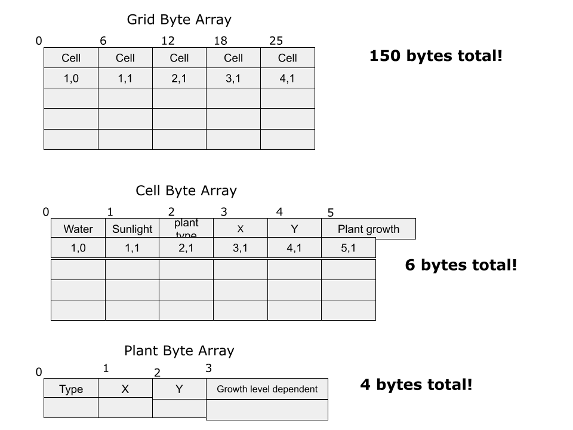

# CMPM121 Final Project: Group 2
<details>
<summary>
 
# Devlog Entry - [11/20/2023]</summary>
<br>

## Introducing the team
### Tools Lead 
Julian Lara
### Engine Lead 
Hung Nguyen
#### Assistant Engine Lead 
Benthan Vu
### Design Lead
Abel Goy
#### Assistant Design Lead 
Anthony Garcia


## Tools and materials
### Engine
We intend to use Phaser, since everyone on our team took CMPM 120, so we already have experience with using Phaser. It’s also built for making web games, and quickly making prototypes, which is perfect for this project.

### Language
We are using JavaScript since it’s what we’ve used for our previous Phaser projects, and so we already have a lot of sample code we can reuse and rework to quickly implement the design requirements and focus on polishing and refactoring our code.

### Tools
The tools we expect to use are VScode, GitHub, Prettier, and ChatGPT.  VScode is a simple choice due to it being very compatible with the Phaser engine, which we intend to use.  GitHub is also an easy choice, as it’s the best platform for code management and version control.  Prettier will be a useful tool to keep our code format consistent and easy to read.  ChatGPT, while likely not being the main crux of writing code for our project, will be used for debugging.  


## Outlook
### Accomplishment Goals
Our team is hoping to accomplish the creation of a farming game that utilizes tilemaps and grid-based inventories for farming.  We also hope to accomplish a quality level of game feel by utilizing Phaser’s particle emitter system.  

### Hardest/Riskiest Part
We anticipate that the hardest part of the project will be having to change our implementation of core elements of our game due to the changing requirements. We also anticipate that maintaining a good design in order to easily add future design requirements may be difficult.

### Hoping to learn
We are hoping to learn how to quickly refactor our code to make future code changes easier to perform, which will be made significantly easier with the tools we chose, since we are already familiar with them. For us, the challenge won’t be learning the tools we use, but the actual core of the project and its changing requirements.

</details>

<details>
<summary>
 
# Devlog Entry - [11/28/2023]</summary>
<br>

## (F0) How we satisfied the software requirements

### [F0.a] You control a character moving on a 2D grid.
We satisfied this requirement by creating a player prefab and adding listeners for the keys W, S, A, and D as directions for controlling the character.

### [F0.b] You advance time in the turn-based simulation manually.
We satisfied this requirement by creating a listener for player input on key T so that each time a player presses that key, a UI indicator in the top left shows that what time has passed and what day the player is on according to the time.

### [F0.c] You can reap (gather) or sow (plant) plants on the grid when your character is near them.
We satisfied this requirement by creating plant classes with seperate growth levels/requirements in Plant.js, as well as allowing the player to reap the plants with key Q and sow new plants with keys 1, 2, or 3, sowing carrots, tomatoes, and potatoes respectively.

### [F0.d] Grid cells have sun and water levels. The incoming sun and water for each cell is somehow randomly generated each turn. Sun energy cannot be stored in a cell (it is used immediately or lost) while water moisture can be slowly accumulated over several turns.
We fulfilled this requirement by creating a prefab, Grid.js, which generated a random amount of sunlight and water for each cell on the grid. Each grid cell has a sun and water level that is viewable by pressing the key E, which will display through text both variables pertaining the water and sunlight information.

### [F0.e] Each plant on the grid has a type (e.g. one of 3 species) and a growth level (e.g. “level 1”, “level 2”, “level 3”).
We fulfilled this requirement through creating plant classes in the Plant.js prefab specifying each plants type and growth levels. Each plant starts at growth level 1, and setting the sprite scale to increase in size once it's growth levels have been reached.

### [F0.f] Simple spatial rules govern plant growth based on sun, water, and nearby plants (growth is unlocked by satisfying conditions).
We fulfilled this requirement by first creating a function in our grid prefab known as getNearCells, which creates and returns an array of data and based on what cells are around a plant that has been sown. Once the plant has been sown, conditionals read by using the nearCells array will be used to determine whether the plant is able to ascend to the next level or not by the next day.

### [F0.g] A play scenario is completed when some condition is satisfied (e.g. at least X plants at growth level Y or above).

## Reflection

### How has the team’s plan changed?
So far the team's plan hasn't necessarily changed, as we are laying a base foundation for our game's mechanics. We have not yet reached a point where our team has had to change course for what our finished game will look like.

### Did you reconsider any of the choices you previously described for Tools and Materials or your Roles?
We have not reconsidered our choices regarding tools or materials, as all of the currently established tools and materials are satisfactory with all of the current requirements.

### [F0.g] A play scenario is completed when some condition is satisfied (e.g. at least X plants at growth level Y or above).
We fulfilled this requirement by creating an inventory system for the player to show the plants that they've collected, as well as a conditional that checks whether they have collected a total of 5 plants for their inventory at growth level 3.
</details>

<details>
<summary>

# Devlog Entry - [12/04/2023]</summary>
<br>

## (F0) How we satisfied the software requirements

### [F0.a] You control a character moving on a 2D grid.
There were no major changes made for this requirement. A player prefab and listeners are still used for the keys W, S, A, and D as directions for controlling the character.

### [F0.b] You advance time in the turn-based simulation manually.
We modified the way that time flowed for this requirement. There is still a listener for player input on key T that advances time when pressed shown by UI indicator in the top left, however we've reworked it so that the time does not flow quickly if the button is held, and it instead advances time press by press for more control of the days.

### [F0.c] You can reap (gather) or sow (plant) plants on the grid when your character is near them.
Plants can be collected with key Q and sow new plants with keys 1, 2, or 3, sowing carrots, tomatoes, and potatoes respectively. However, NOW the reaping/sowing of plants is stored onto the undo and redo action stacks as their reaping and sowing is read.

### [F0.d] Grid cells have sun and water levels. The incoming sun and water for each cell is somehow randomly generated each turn. Sun energy cannot be stored in a cell (it is used immediately or lost) while water moisture can be slowly accumulated over several turns.
The implementation for requirement has by creating a prefab, Grid.js, which generated a random amount of sunlight and water for each cell on the grid. Each grid cell has a sun and water level that is viewable by pressing the key E, which will display through text both variables pertaining the water and sunlight information.

### [F0.e] Each plant on the grid has a type (e.g. one of 3 species) and a growth level (e.g. “level 1”, “level 2”, “level 3”).
Each plant on the grid still has a type and growth level, but now they are stored in a way that adheres storage of each plant's data (growth and type) to a byte array for every cell on the grid.  

### [F0.f] Simple spatial rules govern plant growth based on sun, water, and nearby plants (growth is unlocked by satisfying conditions).
The spatial rules have remained the same.

### [F0.g] A play scenario is completed when some condition is satisfied (e.g. at least X plants at growth level Y or above).
We made no major changes for this requirement, an inventory system is still around for the player to show the plants that they've collected, as well as a conditional that checks whether they have collected a total of 5 plants for their inventory at growth level 3. 

## (F1) How we satisfied the software requirements
### [F1.a] The important state of each cell of your game’s grid must be backed by a single contiguous byte array in AoS or SoA format. Your team must statically allocate memory usage for the whole grid.
We satisfied this requirement by making the grid a byte array using the Array of Structures format. The grid is split up between all 25 cells. Within each cell, it's split up between the data about the cell and the actual plant data. However, it is all accessible and theoretically capable of being changed from anywhere. 


### [F1.b] The player must be able to undo every major choice (all the way back to the start of play), even from a saved game. They should be able to redo (undo of undo operations) multiple times.
We satisfied this requirement by creating two stacks: one for undone actions and one for redone actions. Any time an action is made, that action is pushed onto the undo stack. Actions can be defined through a player's movement, time passing, plant sowing and reaping. Whenever an action is undone, that action is popped from the undo stack and pushed onto the redo stack. 
The redo stack ONLY keeps tracks of actions that have been undone. If the player chooses to redo, the latest action is popped off of the redo stack and the game's state is changed accordingly. 

### [F1.c] The player must be able to manually save their progress in the game in a way that allows them to load that save and continue play another day. The player must be able to manage multiple save files (allowing save scumming).
We satisfied this requirement by creating a save file prefab, which retains the water and sun levels of each of the cells, the day and time that the player saves at, which plants are on each of the cells in the grid and what level each plant is currently at. 
The save file also retains what the plants are stocked in the inventory, as well as the undo and redo stacks. All of this is stored locally in a stringified JSON, which is parsed upon loading.

### [F1.d] The game must implement an implicit auto-save system to support recovery from unexpected quits. (For example, when the game is launched, if an auto-save entry is present, the game might ask the player "do you want to continue where you left off?" The auto-save entry might or might not be visible among the list of manual save entries available for the player to load as part of F1.c.)
We satisfied this requirement by setting a time interval of about 50 seconds, as to which the state of the game is stored locally and will be automatically loaded upon reopening the window (on the condition that the user chooses to load the autosave via text prompt button).

## Reflection

### How has your team’s plan changed? 
Our teams plan changed in how we wanted to approach the requirements for F1. At first, we thought that we would tackle each of the requirements in a modular manner. We would assign one part of each of the requirements to a team member, and complete them separately or in order based on the dependencies of each requirement (Saving req before auto-saving req, undoing req before saving req). One of the requirements in particular, (F1.a) was particularly difficult to implement so we had to come together as a team and discuss the best way to integrate the contiguous byte array into the system we'd already created.

### Did you reconsider any of the choices you previously described for Tools and Materials or your Roles? 
We have not considered changing any of the tools, materials, or roles at this point in the project. Professor Adam called out our group for being the one that stuck to JavaScript rather than TypeScript, and losing an opportunity for type checking. However, at this point we're fairly deep into development to the point where switching over to TS would be more trouble than it seems worth for.

### Has your game design evolved now that you've started to think about giving the player more feedback?
Our design has somewhat evolved through the recent requirement changes, as creating systems for players to undo their changes makes it a game where they don't need to think about consequences (although they didn't need to in the first place). Creating a lose condition could be interesting despite not being part of future requirements, but for now we will invest in providing feedback with the game's current restraints.
</details>

<details>
<summary>

 # Devlog Entry - [12/11/2023]
</summary>
<br>

## (F2) How we satisfied the software requirements
### (F0+F1)
The previous F0 and F1 requirements remain satisfied in the latest version. There are no major changes for F0 and most of F1. The only major change from F1 is F1.a, where we rewrote the plant data byte array to deal with some bugs relating to plant sprites.

##### [F0.a] You control a character moving on a 2D grid.

 - There were no major changes made for this requirement.

##### [F0.b] You advance time in the turn-based simulation manually.

 - There were no major changes made for this requirement.

##### [F0.c] You can reap (gather) or sow (plant) plants on the grid when your character is near them.

 - There were no major changes made for this requirement.

##### [F0.d] Grid cells have sun and water levels. The incoming sun and water for each cell is somehow randomly generated each turn. Sun energy cannot be stored in a cell (it is used immediately or lost) while water moisture can be slowly accumulated over several turns.

 - There were no major changes made for this requirement.

##### [F0.e] Each plant on the grid has a type (e.g. one of 3 species) and a growth level (e.g. “level 1”, “level 2”, “level 3”).

 - There were no major changes made for this requirement.

##### [F0.f] Simple spatial rules govern plant growth based on sun, water, and nearby plants (growth is unlocked by satisfying conditions).

 - There were no major changes made for this requirement.

##### [F0.g] A play scenario is completed when some condition is satisfied (e.g. at least X plants at growth level Y or above).

 - There were no major changes made for this requirement.


##### [F1.a] The important state of each cell of your game’s grid must be backed by a single contiguous byte array in AoS or SoA format. Your team must statically allocate memory usage for the whole grid.

 - We rewrote the dataview to deal with some bugs where sprites would stay on the screen or have incorrect sizes. The state of cell in the grid is still backed by an array in AoS format. The change was that we have a parallel array that only has the plant sprites. This is because the sprites aren't important data values that need to be kept in the byte array. The sprites aren't unique, unlike water level or plant growth level, which is different for each cell.

##### [F1.b] The player must be able to undo every major choice (all the way back to the start of play), even from a saved game. They should be able to redo (undo of undo operations) multiple times.

 - There were no major changes made for this requirement.

##### [F1.c] The player must be able to manually save their progress in the game in a way that allows them to load that save and continue play another day. The player must be able to manage multiple save files (allowing save scumming).

 - There were no major changes made for this requirement.

##### [F1.d] The game must implement an implicit auto-save system to support recovery from unexpected quits. (For example, when the game is launched, if an auto-save entry is present, the game might ask the player "do you want to continue where you left off?" The auto-save entry might or might not be visible among the list of manual save entries available for the player to load as part of F1.c.)

 - There were no major changes made for this requirement.

### [F2.a] External DSL for Scenario Design

Our external DSL is based on YAML. A scenario can be defined by first having a name and a key-value pair with a key called start. This can affect the player's inventory by having them start with plants in their inventory. This also affects the farm grid by allowed scenarios to place plants when the game starts. The external DSL also allows users to set the time and day when the game starts, as well as set a day for an crop failure event to happen where all plants die.

```yaml
- name: "Random Farm"
  start:
      player:                         # spawn player at 1,1 on the grid with an empty inventory
          x: 1
          y: 1
          inventory:
      grid:                           # place plants on the farm grid
          - plant:                    # place a carrot plant with growth level 1 at position 0,1 on the grid
                name: "Carrot"
                level: 1
                x: 0
                y: 1
          - plant:                    # place a banana plant with growth level 3 at position 3,2 on the grid
                name: "Banana" 
                level: 3
                x: 3
                y: 2
      environment:                    # set the starting time to 2 and day to 3, as well as set a crop failure event to happen on the start of day 8
          time: 2
          day: 3
          event: 8
```

### [F2.b] Internal DSL for Plants and Growth Conditions

```javascript
    function tomato($) {
        $.name("Tomato");
        $.type(2);
        $.image("tomato");
        $.rulesDisplay("Tomato growing rules:\n- if water level is greater than 25\n- and the sunlight level is greater than 4\n- and there is at least one nearby plant");
        $.growsWhen((rules) => {
            if (rules.sunLevel <= 4) return false;
            if (rules.waterLevel <= 25) return false;
            if (rules.nearDiffPlants <= 0 && rules.nearSamePlants <= 0) return false;
            return true;
        });
    }
```
The language we use for our internal DSL is JavaScript. 
This function in our internal DSL defines a tomato plant that the game can use. It initializes many properties: 
 - The display name is set to "Tomato"
 - The plant type is set to 2 (used for the dataview)
 - The image path is set to "tomato"
 - Sets the rules display to text that the player can read to understand how the plant grows
 - Creates a callback function that returns true if the plant growth rules are satisfied, else otherwise

The "growsWhen" function allows our internal DSL to use JavaScript features to check the conditions of the plant to decide whether it can grow or not. Since it is a callback function, it allows us to use many features of JavaScript to define how a plant could grow. We could probably add a new condition that checks if the player is a certain distance away from the plant before it can grow, which would be hard to define in an external DSL.

## Reflection
Our team's plan has changed a little. Our roles don't really mean anything since we all work on various parts of the game (we each volunteer to do tasks). We did reconsider our use of JavaScript instead of TypeScript. However, it will take too much time for us to figure out how to switch languages due to it being finals week. Our game design has not really evolved from before. We still have plants that increase size with their growth level and info popups if the player presses E or R on a plant. Something we could add if we have extra time is like tinting the grid tiles a certain color to help visually display their sun and water level.
</details>

<details>
<summary>
 
# Devlog Entry - [12/13/2023]</summary>
<br>

## How we satisfied the software requirements
### F0+F1+F2

##### [F0.a] You control a character moving on a 2D grid.

 - There were no major changes made for this requirement.

##### [F0.b] You advance time in the turn-based simulation manually.


##### [F0.c] You can reap (gather) or sow (plant) plants on the grid when your character is near them.


##### [F0.d] Grid cells have sun and water levels. The incoming sun and water for each cell is somehow randomly generated each turn. Sun energy cannot be stored in a cell (it is used immediately or lost) while water moisture can be slowly accumulated over several turns.


##### [F0.e] Each plant on the grid has a type (e.g. one of 3 species) and a growth level (e.g. “level 1”, “level 2”, “level 3”).


##### [F0.f] Simple spatial rules govern plant growth based on sun, water, and nearby plants (growth is unlocked by satisfying conditions).


##### [F0.g] A play scenario is completed when some condition is satisfied (e.g. at least X plants at growth level Y or above).


##### [F1.a] The important state of each cell of your game’s grid must be backed by a single contiguous byte array in AoS or SoA format. Your team must statically allocate memory usage for the whole grid.


##### [F1.b] The player must be able to undo every major choice (all the way back to the start of play), even from a saved game. They should be able to redo (undo of undo operations) multiple times.


##### [F1.c] The player must be able to manually save their progress in the game in a way that allows them to load that save and continue play another day. The player must be able to manage multiple save files (allowing save scumming).


##### [F1.d] The game must implement an implicit auto-save system to support recovery from unexpected quits. (For example, when the game is launched, if an auto-save entry is present, the game might ask the player "do you want to continue where you left off?" The auto-save entry might or might not be visible among the list of manual save entries available for the player to load as part of F1.c.)


### [F2.a] External DSL for Scenario Design


### [F2.b] Internal DSL for Plants and Growth Conditions


### Internationalization


### Localization


### Mobile Installation


### Mobile Play (Offline)


## Reflection


</details>
